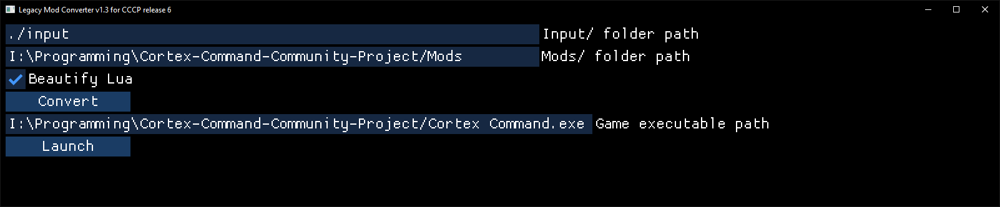

<h1 align="center">Cortex Command Legacy Mod Converter</h1>

## Introduction

Automatically converts mods to the latest version of the [Cortex Command Community Project](https://github.com/cortex-command-community/Cortex-Command-Community-Project).

This program presents a GUI for the [Cortex Command Mod Converter Engine](https://github.com/MyNameIsTrez/Cortex-Command-Mod-Converter-Engine) library that is doing the hard work behind the scenes.

## Installation

Go to the [releases page](https://github.com/cortex-command-community/Cortex-Command-Legacy-Mod-Converter/releases).

## Conversion rules

This line from `rules/ini_copy_of_rules.json`:

`"Round M16": "Round Ronin M16",`

states that whenever `Round M16` is encountered by the converter, it should change it to `Round Ronin M16`.

This means you can make the converter "smarter" by adding more rules to the JSON files in the `rules/` directory.

[This tutorial](https://github.com/cortex-command-community/Cortex-Command-Legacy-Mod-Converter/wiki/Fixing-CCCP-crashes-and-errors-with-Fork) goes over how you can use Fork to figure out what things were renamed to in the newer versions of the game, so you can add missing conversion rules.

## Compiling the program

1. Download Zig version 0.12.0 for Windows from [here](https://ziglang.org/download/0.12.0/zig-windows-x86_64-0.12.0.zip). You'll need to add the path to its unzipped directory to your system's `Path` environment variable. Confirm it works by running `zig version` in a terminal.
2. Clone this repository.
3. Clone the [Cortex Command Mod Converter Engine](https://github.com/MyNameIsTrez/Cortex-Command-Mod-Converter-Engine) repository next to it.
4. Open this repository in VS Code, and hit the `F5` key to compile and run the program.
