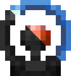
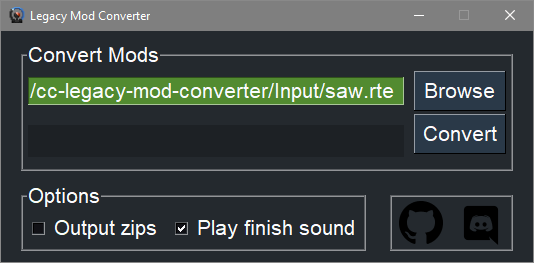

<h1 align="center">Cortex Command Legacy Mod Converter</h1>

## Introduction
This project automates ***most*** of the conversion work required to convert the legacy (old) `Cortex Command` mods into `Cortex Command Community Project` compatible mods.

## Getting started
If you have CCCP pre3 or an even newer version of it then you don't need to install anything. Just go to where you have CCCP installed, go into the `_Mod Converter` folder and put your legacy mods in the `Input` folder. Run the `Legacy Mod Converter.exe` program, hit the `Convert` button and you can now close the converter. The resulting converted mods are now placed in the CCCP folder next to the other .rte folders (like `Coalition.rte`). You can now test out your converted mod!

If you don't have the exe in your CCCP directory for whatever reason you can download the latest version of `Legacy.Mod.Converter.exe` by pressing the `Releases` button on the right side of this page. Create a new folder and put your legacy mods that you want to convert in that folder. Run the `Legacy.Mod.Converter.exe`, browse to the folder you put your legacy mods in and you can then use the converter like explained under the `Getting started` header.

If you get a "`Microsoft Defender SmartScreen prevented an unrecognized app from starting. Running this app might put your PC at risk.`" popup message when trying to run the program you should press `More info` and then `Run anyway`.

## Disclaimer
This program will do most of the conversion work for you, but even though this converter will already automatically apply more than 500 mod changes that have been made between Cortex Command and CCCP there are always more changes out there that haven't been added to the converter yet.

It's for this reason that it's almost guaranteed that CCCP will still crash with a crash message or with errors in the console after conversion, but the point of this converter is to do 99% of the work for you, 100% is only realistic for some tiny mods. You'll want to manually fix these issues using the instructions in the next section.

## What are conversion rules
Conversion rules are a way of informing the program of the changes that have been made between Cortex Command and CCCP and how it can fix them. These conversion rules are stored in JSON files in the `ConversionRules` folder. You absolutely don't need to have any programming experience to start adding conversion rules to any of the JSON files.

Take for example this line from `ConversionRules/Misc.json`:

`"Round M16": "Round Ronin M16",`

What this line of JSON says is that whenever the thing on the left is encountered in a mod, it should be replaced with whatever is on the right of it. So, this conversion rule says that whenever `Round M16` is encountered in a mod that's being converted it should be changed to `Round Ronin M16` by the converter.

## How to add your own conversion rules
* [Download “Notepad++”](https://notepad-plus-plus.org/downloads/) - Like Notepad. Allows mass replacing across thousands of files at once. You can also use an IDE like [VS Code](https://code.visualstudio.com/) for this purpose.

Open any of the JSON files in the `ConversionRules` folder with Notepad++ and add the line `"": "",` in a similar manner to how the other lines in the file are already placed. You can then start putting stuff between the quotation marks on the left and right side, like in the example in the previous "What are conversion rules" section. You've now taught the converter how to apply one more conversion rule.

If you put the right things between the quotes that CCCP was complaining about, then you can start the converter once more and you'll see that the crash/error should have disappeared. Repeat this process until the mod is fully converted and playable with no console errors (to check for console errors press the `` ` `` key in CCCP).

## How to figure out what conversion rule to add to get rid of crashes and errors
Follow [this tutorial on fixing CCCP crashes and errors with Fork](https://github.com/cortex-command-community/Cortex-Command-Legacy-Mod-Converter/wiki/Fixing-CCCP-crashes-and-errors-with-Fork).

## Contributing
Feel free to submit `Pull Requests` or `Issues` on this GitHub project for any additional cases that you'd like to have supported.

## Getting help
If you need help with anything you can contact the creator of this repository directly (`#MyNameIsTrez1585` on Discord), or you can ask the friendly regulars in the CCCP Discord server in `#modding-discussion` for help. It helps us if you mention where you've gotten stuck while reading this tutorial, so please do that! :)
